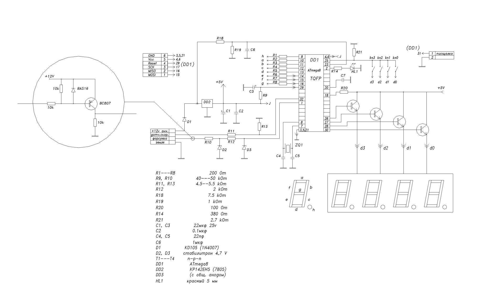
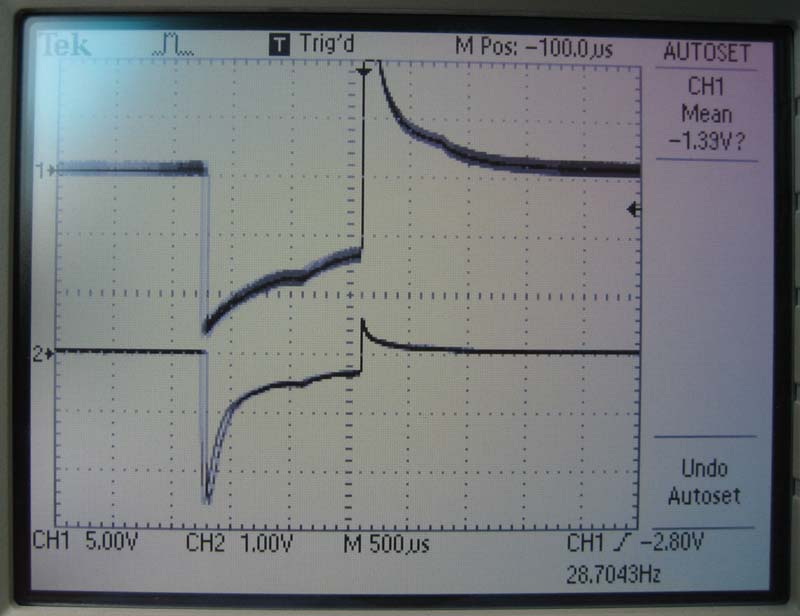
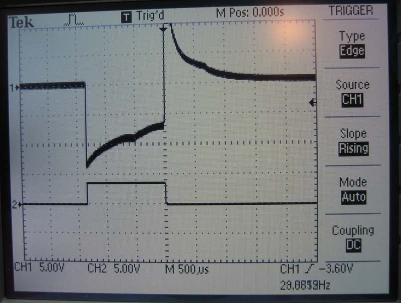
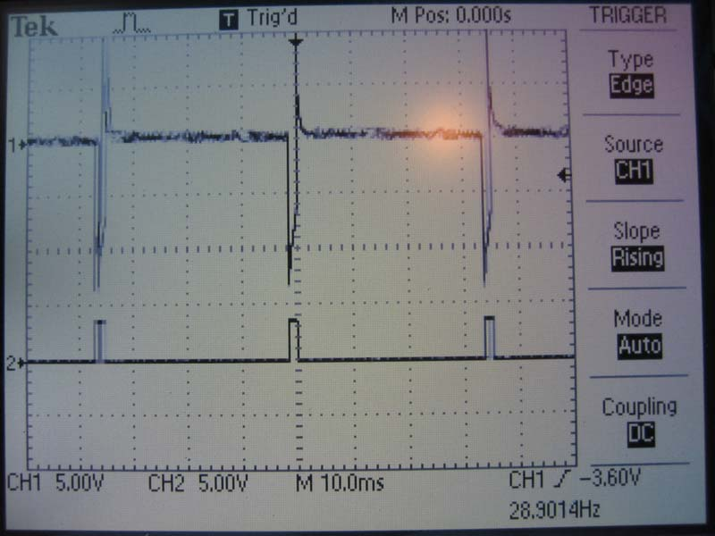
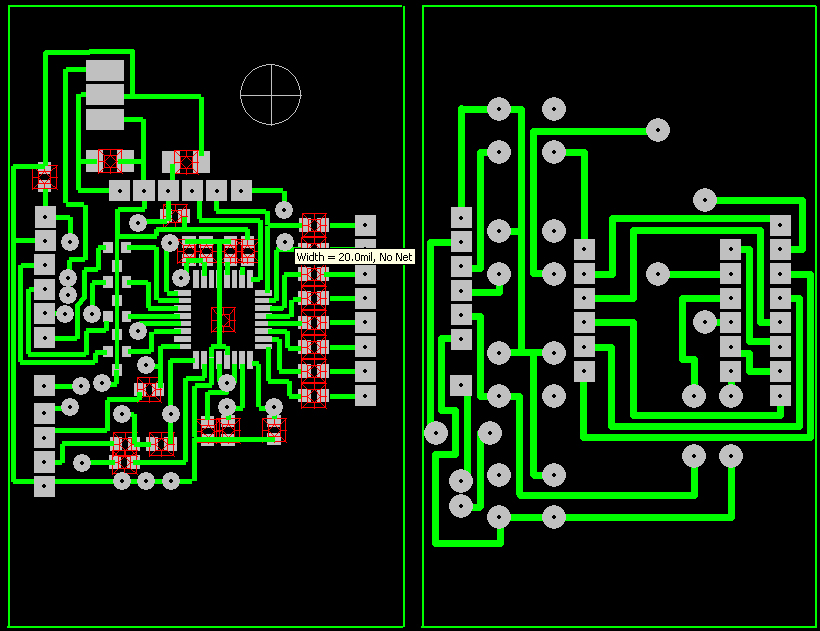
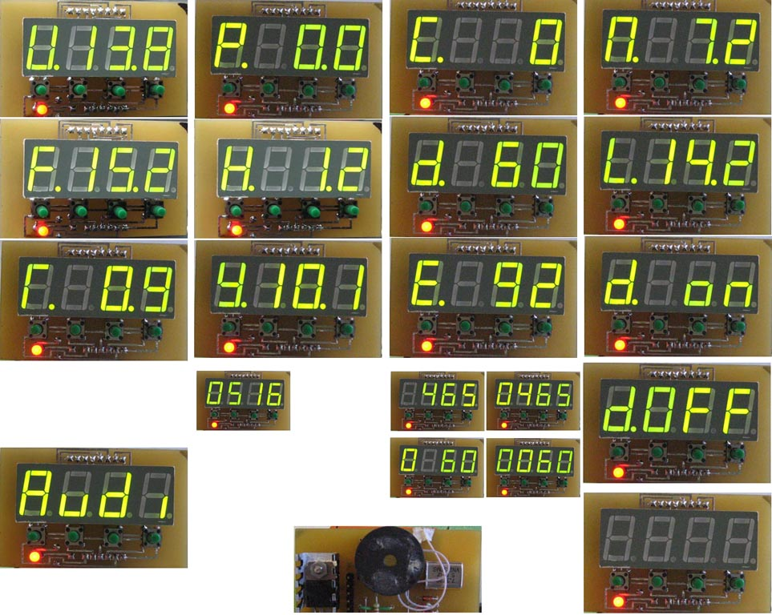
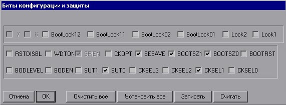

# Простейший бортовой компьютер на любой инжекторный двигатель (ATmega8, C++)

**Автор:** Дмитрий Кондратьев  
**Оригинальная дата разработки и публикации:** Август 2008 г.  
**Платформа:** Микроконтроллер Atmel ATmega8, язык C++ (компилятор IAR Embedded Workbench for AVR)  
**Исторический статус:** Проект №141 (p141) Всероссийского конкурса микроэлектронных проектов компании «Телесистемы» (г. Зеленоград), материал «Краткого курса — Самоучителя по AVR» (`proavr.narod.ru` / `avr123.nm.ru`).

---

## Авторский текст статьи (Оригинал 2008 года)

Все началось с того, что как мне казалось, у меня большой расход топлива. Машина у меня Audi-80 с 2-х литровым движком (ABT) и моновпрыском (одна электрическая форсунка стоит во впускном коллекторе, т.с. вместо карбюратора). 

Когда я разобрался, как работает система впрыска, все оказалось очень просто, вот тогда и загорелся сделать какой-то расходомер, типа. Тем более на моей машине 93 года с моновпрыском MOTRONIC 1.2 через K-Line можно снять только значения по лямбде, обороты двигателя и его температуру. Даже, если разобраться в конкретном для моей машины протоколе обмена - больше того, что показывает диагностика уже не считать, ну и конечно, тем более не показывается там длительность впрыска. 

И тогда начал искать в Интернете, что можно придумать и сделать, а также спрашивать на разных форумах. Если кто-то и делал что-то подобное, то обязательно тока за денежку. Но я ведь старый радиолюбитель, но никогда не работал с микроконтроллерами, правда. Тогда решил начать с их изучения, и мой выбор пал на микроконтроллеры семейства AVR фирмы Atmel. Писать решил на Си, т.к. в свое время увлекался Borland C++. Все так в Интернете нашел похожую электрическую схему и использовал ее как образец. Переделал ее и изменил под свои «нужды» и получилось следующее:

  
*(нажмите на изображение схемы для открытия в оригинальном высоком разрешении 1857×1157)*

Вначале схема отказывалась правильно считать – видно по осциллограмме, почему. Поэтому поставили на вход ключ на транзисторе, правда, сигнал инвертировался, но проще изменить было в программе. И тогда стало все просто гут, смотрите на осциллограммах (сигнал на форсунке; и на ноге входа котла, нижняя осциллограмма на фотках):

  
*(нажмите для увеличения)*

  
*(нажмите для увеличения)*

  
*(нажмите для увеличения)*

Также желательно (а может и обязательно) транзисторный ключ поставить на вход сигнала с датчика скорости (повторитель, не инвертор; или тогда изменить в коде).

И так, эту схему можно подключить к любой машине (думаю) с электрическими форсунками. Все подключение – к одному контакту на форсунке и к одному контакту на датчике скорости, ну и плюс питание. Конечно, эту схему я делал как опытный образец, и поэтому перед разводкой платы не предусматривал конкретного корпуса и места под установку в машине. Также могу добавить, что сама разводка не очень удачная. Тем не менее, прикладываю то, что получилось:

  
*(нажмите для увеличения)*

Кстати производительность применяющихся электрических форсунок можно взять здесь - `http://users.erols.com/srweiss/tableifc.htm`. Исходя из этой таблицы производительность моей форсунки - 819 см3 в мин. Далее, от полной заправки до полной заправки "смерил" литраж и сверил по своему расходомеру. В результате калибровки получилась произв. моей форсунки – 516. То, что она так отличается от справочной, так это: "жизненное засорение" форсунки: основная причина - прослабление пружины в перепускной камере, следствие - уменьшение давления впрыска (надеюсь, что в диапазоне допустимого), ну можь еще что.

Датчик скорости - 2-х контактный, выдает 4 импульса за один оборот колеса с амплитудой ~8V.

Вначале у меня показывалось только: напряжение борт. сети, полный расход и часовой расход. В настоящее время число показаний режимов увеличено:

  
*(нажмите для увеличения)*

### Краткое описание к приложенной фотке:

При включении - на 0.5 сек. появляется – Audi, затем напряжение. Всего управляющих кнопок 4. 

* **При нажатии 1-й (слева) кнопки:** появляется `(F.)ull` – полный расход; при следующем ее нажатии – `(Г.)рязный` – расход стоя, на ХХ, при скорости < 7 км/ч; еще раз нажать – опять `(U.)` – напряжение. Если держать кнопку при напряжении более 2-х сек. комп. переходит в спящий режим (Idle), из которого выходит по прерыванию от форсунки. При `(F.)` – более 2-х секунд, он обнуляется. Также при этом обнуляются `(Г.)` и `(У.)`. `(F.)` и `(Г.)` сохраняются при выкл. двигателя.
* **При нажатии 2-й (слева) кнопки:** появляется `(Р.)асход` – мгновенный (за 1 сек.) расход на 100 км; далее `(H.)` – мгнов. (за 1 сек.) часовой расход; далее `(У.)средненный` расход на 100 км. за расстояние, пройденное при скорости >= 7 км/ч. При `(H.)` более 2-х сек. переходим к вводу производительности форсунки от 0-9999 см3(мл.)/сек. У меня после калибровки – 516 мл/сек. `(У.)` сохраняется.
* **При нажатии 3-й (слева) кнопки:** появляется `(С.)корость` – мгнов. (за 1 сек.) скорость; далее `(d.)anger` - скорость, при превышении которой звучит пьезик 1 сек. Если скорость упадет меньше (d-5), при превыш. `(d.)` будет подан опять сигнал. В ином случае сигнал не повторится; далее `(E.)xstra` – макс. скорость которая была. При `(С.)` более 2-х сек. переходим к вводу кол-ва сигналов с датчика скорости за 1 км. У меня – 465 (на 1 км). При `(d.)` более 2-х сек. переходим к вводу скорости, при превыш. которой будет подан сигнал. При `(E.)` более 2-х сек – знач. обнуляется. `(d.)` и `(E.)` сохраняются.
* **При нажатии 4-й (слева) кнопки:** появляется `(П.)уть` – пройденный путь; далее `(L.)` - пройденный путь 2; далее `(d.OFF)` – при этом будет отключен пьезик при превышении скорости при заданном знач. Когда мы вернемся опять к этому режиму появится `(d. on)` – и пьезик будет готов к работе. При `(П.)` и `(L.)` более 2-х сек. – знач. обнуляются. При `(d.OFF)` или `(d. on)` более 2-х сек. – гасятся индикаторы, при этом комп продолжает работать и горит светодиод.

Там где значение с десятыми, при достижении 99.9 – отображение происходит в целых.

Код программы написан в IAR-е на Си. Насчет комментариев - когда я их писал, еще не очень до конца разбирался в работе микроконтроллеров, и в некоторых местах есть где-то немного неверные толкования, но думаю, все равно все и так будет понятно, а если кому надо, исправьте сами. Единственная сложность в этой программе – это определение расхода. Все что касается вывода все остальных режимов так это уровень математики средней школы. 

…Так что кому все еще не понятно как вычисляется расход, немножко поясню. Производительность форсунки (задается любая от 0-9999, находим (калибруем) ее после израсходования топлива от одной полной заправки до следующей), к примеру, у нас получилось - 530 см3/мин=0,53л/мин(0,00883л/сек). Частота оборотов двигателя на ХХ, к примеру - 950, значит, форсунка открывается с частотой 29 Гц (примерно все более-менее и зависит от системы впрыска). Время открытия форсунки из осциллограммы - 1,33 мс (0,00133 сек), значит, за это время впрыскивается - 0,00883/(1/0,00133)=0,0000117 л. Теперь умножаем на 29 и получаем - 0,00034 л/с, далее умножаем на 3600 и получаем - 1,226 л/час на ХХ. Это просто для примера. Естественно все это можно записать одной небольшой строкой и к тому же частоту, а, следовательно, время открытого состояния форсунки за нас будет делать таймер. Ну а нам главное - это найти время впрыска одного импульса, используя 16-разрядный (желательно) таймер. Зная производительность форсунки за 1 сек., и определив общее время ее открытого состояния в 1 сек. можно найти расход (мгновенный на данном режиме) за одну секунду. А все остальное находим, уже оперируя этим значением. 

Определение абсолютного расхода задача не стояла, т.к. при этом нужно учитывать много разных факторов. Естественно все мне это известно, тем более с теорией двигателя знаком не понаслышке. Так что для определения относительного расхода и знать из-за чего идет перерасход, на каких режимах, при каких нагрузках и т.д., такого алгоритма больше чем достаточно.

Для общей картины приведу некоторые снятые фактически данные. 
На ХХ при 950 оборотах и Тдв.=90 гр. часовой расход 1,2 л, при 0 за бортом и выкл. потребителях, напряжение - 13.9-14В. Еще есть такие данные при -15 гр. зимой. Проехал - 71,8 км, полный расход получился - 16.8 л. Расход на ХХ и при скорости < 7 км/ч - 7.9 л (на ХХ много в тот раз сжег). Средний расход при этом - 13,2 л. По трассе (перед этим все обнулил) расход средний был 7 л на 100 км, пока не въехал в город. При +10, как только заводишь в первые сек. часовой расход был - 2,5-3 л. При -15 гр. - 8 литров, и соответственно мгновенный расход на 100 км больше, пока не прогреется достаточно. Средний расход конечно тоже в первые метры поездки немного увеличивается, потом опять восстанавливается до ~13 /100 км. На ХХ ходу при прогретом движке и при -15 гр. за бортом - те же 1,2 л в час. (у меня картонка еще перед радиатором, не на весь, стоит).

Ну и вот и все в кратце.

Теперь буду делать новый комп. с графическим ЖК-индикатором, чтобы сразу отображалось все, а при нажатии - определенный режим высвечивался бы на весь экран. Также наверно применю 64-ю Мегу, отдельно поставлю память с часами реального времени через SPI, т.к. встроенная очень медленная, а также 2 цифровых датчика температуры – в салоне и за «бортом», ну и может еще что.

**Всем Удачи, Дмитрий.**

---

### Конфигурация Fuse-битов микроконтроллера (ATmega8):

  
*(нажмите для увеличения)*

---

## Полная опись архивных файлов репозитория

В репозиторий включены все оригинальные файлы проекта без изменений:

1. **`main.cpp`** (30.56 КБ) — оригинальный полный исходный код прошивки на Си для среды IAR Embedded Workbench.
2. **`indprog.a90`** (22.32 КБ) — скомпилированный бинарный файл прошивки для программатора AVR.
3. **`shema.jpg`** (1857×1157, 90.10 КБ) — принципиальная электрическая схема устройства высокого разрешения.
4. **`Plata.pcb`** (127.99 КБ) — оригинальный файл разводки печатной платы для САПР (P-CAD / Sprint-Layout).
5. **`psb.jpg`** (820×631, 278.29 КБ) — графический чертеж топологии дорожек печатной платы.
6. **`osc1.jpg`** (800×616, 62.95 КБ) — осциллограмма исходного импульса форсунки моновпрыска.
7. **`osc2.jpg`** (800×605, 70.10 КБ) — осциллограмма сигнала форсунки с паразитными индуктивными всплесками.
8. **`osc3.jpg`** (800×600, 63.69 КБ) — осциллограмма чистого сигнала на ножке микроконтроллера после транзисторного ключа.
9. **`bity.jpg`** (571×210, 40.92 КБ) — скриншот конфигурационных битов защиты и тактирования (Fuse-bits).
10. **`About.jpg`** (963×768, 184.15 КБ) — фотосессия всех режимов вывода параметров на 4-разрядный светодиодный индикатор.
11. **`Книга1.xls`** (14.50 КБ) — оригинальная калибровочная таблица расчетов расхода топлива и перевода величин в Excel.
